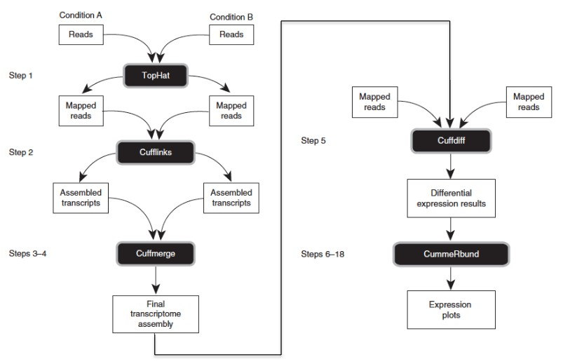
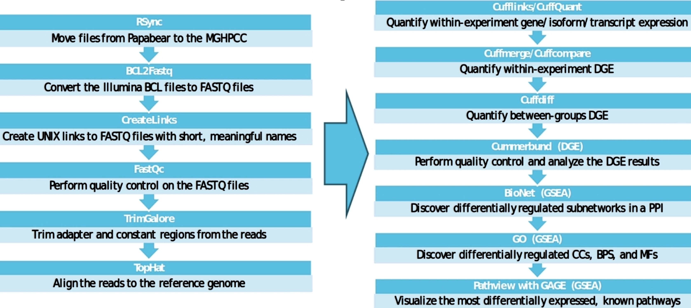
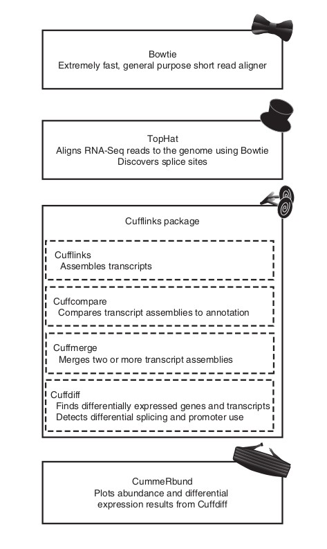
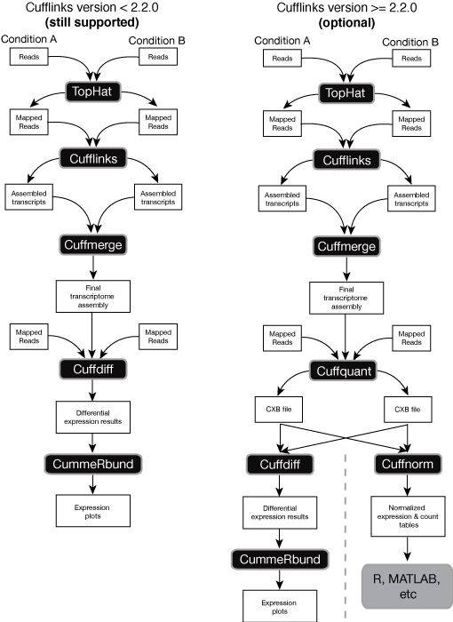

# The Tailor RNA-Seq Differential Expression Analysis Pipeline Quickstart
Tailor is a suite of tools for RNA-Seq differential expression analysis and de-novo disease biomarker discovery. Tailor was designed to facilitate the use of Linux based LSF or SGE shecduled High Performance Computing Cluster (HPCC). Tailor extends and simplifies the **Tuxedo** workflow which  includes **Tophat**, **Cufflinks/Cuffmerge/Cuffcompare/Cuffquant/Cuffdiff**, and **CummbeRbund**.



The main function of the pipeline is to perform statistical comparsions of the pooled RNA-Seq libraries from samples sharing a phenotype or condition in order to identify potential biomarkers from differentially expressed genes. Tailor's workflow can be run as a comparison between one or more conditions or as a time series workflow. Tailor provides an end to end analysis solution for RNA-Seq data produced by Illumina sequencers. The pipeline can be run from later steps with intermediate data formats like multi-fasta, gzipped fastq, and bam files. The Tailor workflow in its entirety is pictured here:




Tailor includes secondary analysis tools to enable more thorough examination of the differentially expressed genes and quantify their utility as potential biomarkers of the condition being studied. The workflow includes additional secondary analysis tools that extend the pipeline as well as prepatory analysis tools that build and retreive the genomic reference materials. Tailor enables users to perform a simplified differential expression analysis as well as a *de novo* analysis that includes several additional steps necessary to perform gene and isoform discovery. More information about each step in the pipeline is provided in the following image:




All of the tools utilized by the Tailor pipeline can be installed via the conda package manager. If not already installed,  install from Anaconda or Miniconda according to your system requirements described at . Once the conda package manager is installed Tailor can be built from the source files provided in this repository after cloning into your working directory.
To copy and source the necessary configuration files perform the following commands:
```
cd Tailor_settings_and_config
cp .bash_profile ../
cp .bashrc ../
cp .condarc ../
cp .Rprofile.envrc ../
cp .envrc ../
cd ../
source .bash_profile
source .bashrc
source .condarc
source .Rprofile.envrc
source .envrc
```
Create a loadable Tailor pipeline environment from the provided Tailor.yml file in this repository

```
conda env create -n Tailor -f Tailor.yml
```
Load the Tailor environment to begin a differential expression analysis

```
conda activate Tailor
```

### Tailor Configuration

    1. Add the tailor directory to your PATH:
        a. Add the following line to your ~/.bashrc:
               export PATH=$PATH:/project/rna-seq/tailor
        b. You can look at my .bashrc as an example or even copy my .bashrc file over to your account.
        c. You will also need to always source your ~/.bashrc by adding these lines to your ~/.bash_profile
                if [ -f ~/.bashrc ]; then
                    . ~/.bashrc
                fi
        d. Again, you can look at or just copy over my .bash_profile.
        e. After you have edited your ~/.bashrc then you can reset your path in your current shell (without starting a new one) be executing source ~/.bashrc.
        f. You can test that your path is correct by executing tailor test and getting the response “Hello from Tailor!”.

    2. Set your TAILOR_CONFIG environment variable to point to the correct Tailor settings file by executing:
        a. export TAILOR_CONFIG=/project/rna-seq/<subdir>/settings.default
            i. replace <subdir> with the name of the organism or pathology being studied
        b. echo $TAILOR_CONFIG
            i. validates that your TAILOR_CONFIG environment variable is set correctly
    
### Editing Tailor settings

You should never have to edit any of the scripts in the tailor install directory. Instead, if you wish to change any of the default settings and re-run one or more steps in the pipeline, then you should only have to create a copy of the existing settings file and then change certain settings contained therein. The proper procedure is:

    1. Create a copy of the settings.default file (or some other existing settings file)
        a. The new settings file should have a name with the format settings.<label> where <label> indicates the changes made to the settings.
        b. Example settings file names:
            i. settings.uniqueMap – indicates that only uniquely mappable reads were used in this analysis.
    2. In the new settings file, be sure to change the INPUT_LABEL and OUTPUT_LABEL to match <label> from step 1 that describes this run of the pipeline.
        a. It is important that your <label> in the settings file name matches the INPUT_LABEL/OUTPUT_LABEL used to label the results directories in order that anyone can easily match them together.
    3. Make the necessary configuration changes inside your new settings.<label> file.
    3. Change your TAILOR_CONFIG environment variable to now point to the new Tailor settings file by executing:
        a. export TAILOR_CONFIG=/project/rna-seq/<subdir>/settings.<label>
            i. replace <subdir> with the name of the organism or pathology being studied
            ii. replace <label> with an informative label to differentiate the analysis from others in your working directory
                   (this variable is set in your settings file)
        b. echo $TAILOR_CONFIG
            i. validates that your TAILOR_CONFIG environment variable is set correctly

To see differences between two different settings files (or any to two text files) use the unix diff tool. The command diff –w settings.file1 settings.file2 will list the differences between the two text files while ignoring whitespace (spaces, tabs, newlines, etc.). Note that lines in the output that start with “<” are contained in settings.file1, while output lines that start with “>” are contained in settings.file2.

### Settings file variables
If you already have a Reference Genome Build, then simply modify the environment variables in your settings file to point to the full path of your reference genome components. Several different settings files are included in the Tailor\_settings\_and\_config directory. The reference genome variables are
GENOME\_FASTA, GENOME\_GTF, and GENOME\_IDX. The INPUT\_DIR variable should point to the directory that houses your input data and your OUTPUT\_DIR variable should be set to the suffix you would like appended to your output directories for each step of the pipeline.

```
INPUT_LABEL="_default"
OUTPUT_LABEL="_default"
MULTIFASTA=/project/umb_triley/genomes/Homo_sapiens/UCSC/hg19/Sequence/WholeGenomeFasta/genome.fa
BOWTIE_INDEX=/project/umb_triley/genomes/Homo_sapiens/UCSC/hg19/Sequence/Bowtie2Index/genome
REFERENCE_GTF=/project/umb_triley/genomes/Homo_sapiens/UCSC/hg19/Annotation/Genes/genes.gtf 
FASTADIR=/project/umb_triley/genomes/Homo_sapiens/UCSC/hg19/Sequence/Chromosomes
HISAT_INDEX=/project/umb_triley/genomes/Homo_sapiens/UCSC/hg19/Sequence/HisatIndex/
HISAT_BASE_NAME=ucsc_hg19

export TAILOR_CONFIG=settings.file
```

Once the TAILOR_CONFIG environment variable is set to point to the settings file (as shown above) you can begin running the pipeline

### Running Tailor
The tailor file included in the repository lists all of the pipeline steps, all of the secondary analysis steps, and how to execute each of them. However, do not execute "tailor all" since this option is currently disabled 
#This is because none of the job submissions currently wait for the previous step in the pipeline to finish.

Before running any step of the Tailor pipeline, it is necessary to change directory (cd) into the correct project directory:

    1. cd /project/rna-seq/<subdir>
        a. replace <subdir> with the name of the organism or pathology being studied
    2. pwd – validates that your present working directory (pwd) is indeed the correct project directory

Once inside the correct project directory, the list of the steps that one generally executes in order from start to finish in order to run the entire Tailor pipeline is below. This is the preferred way to run the Tailor pipeline.

    1. tailor rsync                (if you need to move files to the cluster)
    2. tailor bcl2fastq            (if you need to create FASTQ files from BCL files)
    3. tailor mergeFastq
    4. tailor createLinks
    5. tailor fastqc
    6. tailor trim
    7. tailor tophat
    8. tailor cufflinks
    9. tailor cuffmerge
    10. tailor cuffcompare
    11. tailor cuffquant
    12. tailor cuffdiff
    13. tailor excel
    14. tailor cummerbund
    15. tailor bionet
    16. tailor go
    17. tailor pathview

After executing a step in the Tailor pipeline, you can execute LSF scheduler commands to get the status of your submitted Tailor jobs and of the LSF jobs queues in general. Here is a brief description of the most commonly used LSF commands:

    1. bqueues – gives a brief summary of the number of pending and runnings jobs on the cluster
    2. bjobs – lists all the jobs that are currently running and pending
    3. bkill 0 – kill all of your running and pending jobs
    4. bkill <job_ID> – kill an individual job or remove it from the queue

After the submitted Tailor jobs are finished, it’s important to check the output in the results directory before moving on to the next step in the pipeline.

### Checking Tailor results and troubleshooting

    1. Execute ls -ltgr to see all the configuration files and results directories for your Tailor project.
    2. Use cd <step>_results.<label> to change directory into a particular results directory to find the relevant troubleshooting files and output directories:
        a. input.files.list – a file that contains a list of all the files from the previous step that were used as input for this next step in the pipeline.
        b. jobs.out – a directory that contains 2 files for each job submitted to the job scheduler: *.outand *.error.
            i. *.out – contains all the output piped to STD_OUT for the job followed by the job summary.
            ii. *.error – contains all the output piped to STD_ERROR for the job
                1. Note that not all the output piped to standard error is actually an error. This is especially true for the loadModule statements.
            iii. Executels –altgr to see all the files in chronological order.
            iv. Use the grep tool to search for errors in the *.out and *.error files:
                1. grep –i error *.out – case-insensitive search for the string “error” in all the *.out files.
                2. grep –i error *.error – case-insensitive search for the string “error” in all the *.error files.
        c. jobs.scripts – a directory that contains all the scripts that have been generated and submitted to the job scheduler for this step in the pipeline.
        d. *.jobs.log – a file that contains all the jobs that have ever been submitted for this pipeline step.
        e. settings.<label>.<date>_<time> – a copy of the settings file that was used for the run with that date/time stamp.
    3. The find and xargs commands are very useful to see the important output files for each cufflink step. Change directory (cd) into the results directory and then run one of the following:
        a. tophat:  find . –name “*.bam” –print | xargs ls -l 
        b. cufflinks:  find . –name “*.gtf” –print | xargs ls –l
        c. cuffmerge:  find . –name “*.gtf” –print | xargs ls –l
        d. cuffcompare:  find . –name “*.gtf” –print | xargs ls –l
        e. cuffdiff:  find . –name “*.diff” –print | xargs ls -l

### Including novel transcript discovery

If you want to include novel transcripts in the DGE and GSEA, then the steps you should run are:

    (1) Pipeline that includes novel transcripts
        	.
        	.
        	tailor tophat
        	tailor cufflinks
        	tailor cuffmerge
        	tailor cuffcompare
         tailor cuffquant
        	tailor cuffdiff  (using the GTF file from the cuffcompare step)
        	.
        	.

If you do NOT want to include novel transcripts in the DGE and GSEA, then you can skip the cufflinks, cuffmerge, and cuffcompare steps as follows:

    (2) Pipeline that does NOT include novel transcripts
        	.
        	tailor tophat
         tailor cuffquant
        	tailor cuffdiff  (using the reference GTF file)
        	.

Additionally, the settings variable CUFFDIFF_INPUT_GTF controls whether cuffdiff uses the GTF file from the reference genome or from the individual cufflinks assembled transcripts for each sample that are merged together for the experiment with the cuffmerge step. The cuffcompare step then compares the merged assembly to the reference annotation for unique and duplicate features. To use the GTF file generated by the cuffcompare step set the variable
```
CUFFDIFF_INPUT_GTF="${CUFFCOMPARE}${INPUT_LABEL}/cuffcmp.combined.gtf".
```
In general, the settings files that end with "_default" do not include novel transcripts and thus just use the reference GTF file; while the settings files that end with "_master" or "_gtf_guided" include novel transcripts. The settings.master configuration file allows the user to employ other differential expression analysis software in liue of cuffdiff. Several enhanced workflows are pictured below:



-----------------------------------------------------------------------
# The Tailor RNA-Seq Differential Expression Analysis Pipeline Wiki
-----------------------------------------------------------------------

## Introduction to RNA-seq
 is a high-throughput technology that enables researchers to determine the relative abundance of RNA transcripts isolated and extracted from cellular samples of interest. The immature pre-mRNA molecules are produced according to the genome of the organism which serves as a template. RNA sequence libraries are essentially character string representations of the nucleotides that encode the amino acids required by the cell in order to build biologically necessary proteins (G, C, U, T, or A; often called "bases").Mature RNA consists only of the "expressed" parts of a gene (exons) with the other information (introns) spliced out before translation (to produce proteins). Sequencers use laser excitation of the nucleotide specific coloring of radioactive fluorophores incorporated into the cDNA during the sequencing by synthesis process (illumina's method). This enables us to determine the character sequences of the mature RNA molecules in the cells of interest as well as a quality score for our confidence in the accuracy of the identification of the nucleotide at each sequence position. RNA transcripts are often hundreds or thousands of nucleotides long but current sequencers are only capable of reading about ~100 nucleotides from either end of a RNA transcript. The industry standard format catalouge of RNA transcripts is a text file format called . FASTQ files are considered the "raw" RNA-seq data in its most basic usable form. Data produced by Illumina sequencers is output in a proprietary binary format called bcl which requires specicial conversion software made by Illumina in order to reformat the data into the usable FASTQ format.  Bcl2fastq, the illumina conversion software is the first step in the Tailor pipeline.

## The Importance of RNA-seq Analysis and Personalized Medicine
RNA-Seq data can be analyzed to provide insight into a population's unique genomic features that are different from those of other populations.  RNA-seq analysis has advanced to the point that the genome sequence and unique single nucleotide polymorphisms (SNPS) for a population can be identified from an RNA-Seq experiment of sufficient depth. RNA-Seq analysis provides insight into complex diseases and is a driving force in the new ethos of personalized medicine. Many RNA-Seq analyses yeild a list of features that may provide utility as biomarkers of disease. As the technology develops and becomes less expensive, it may be be employed more regularly in liquid biopsies, non-invasive medical diagnostics that provides a glimpse of the gene expression profile of blood or urine samples. RNA-Seq data produced during time series experiments can be used to identify features that change over time in a population of interest. RNA-Seq transcriptomic analyses are just one level of information that has become available via sequencing.  Proteomic analyses can be layered on top of transcriptomic analyses to produce a more complete picture of the biological mechanisms involved in disease. Sequencing experiments can be designed to characterize different disease phenotypes and the potential for varied response to treatment in relation to a particular genotype.


## Introduction to the Tailor RNA-Seq Analysis Pipeline
The Tailor RNA-Seq pipeline is an end-to-end comparative analysis workflow for *de novo* disease biomarker discovery designed to facilitate translational genomics research. The Tailor pipeline produces a set of disease biomarker genes via comparative analysis of the pooled RNA sequence libraries from groups of samples sharing a condition or disease against a group of archetypally healthy samples serving as a control group. Tailor performs genewise (as well as CDS-wise, TSS-wise, isoform-wise, and spliceoform-wise) hypothesis tests of the distrubition of gene expression between the samples of two or more conditions. Significant differences in the gene expression profiles between the conditions are visualized and catalouged to use as condition specific biomarkers. Tailor simplifies and extends the Tuxedo tool-suite (Tophat, Cufflinks, Cuffmerge, Cuffcompare, Cuffquant, Cuffdiff, CummeRbund) of command line tools in order to mitigate the skills-gap bottleneck that currently exists in the field of personalized medicine.


## Tailor's workflow is characterized by five general steps:
Tailor accomodates several variations of the **Tuxedo** suite pipeline but they all follow this general framework.

#### 1. RNA-Seq Library Preparation
#### 2. Transcript Mapping, Assembly, and Quantification
#### 3. Determination of Significant Differential Expression Via Comparative Analysis
#### 4. Visualization of the Salient Features of the Analysis
#### 5. Biomarker Prediction Refinement

Tailor's analysis is performed via multi-step, in-parallel, computational jobs submitted to the sheduler of a high performance computing cluster (currently compatible with **platform LSF**, **Sun Grid Engine (SGE)**, and **Slurm** schedulers). Many of the steps in the pipeline are submitted as batch jobs that are recursively performed for every sample included in an analysis. Every job submission is associated with resource requests that have been optimized to allocate sufficient computational resources (prevent job failure) without incuring unecessary job wait-times. The resource request values were optimized for the Massachusetts Green High Performance Computing Cluster (MGHPCC), a large HPCC used by the University of Massachusetts, Boston University, Harvard University, MIT, Northeastern University and the Commonwealth of Massachusetts. Tailor drastically reduces the difficulty of analyzing RNA-Seq data with a computing cluster by automating and parallelizing the steps of the analysis via two word commands (“tailor **bcl2fastq**," “tailor **FastQC**"). 

## Tailor's Minimum Requirements for Operation
The user must provide RNA-Seq sample libraries for at least two separate conditions (two sample minimimum) or time points for time series data. The minimum number of samples required to produce high confidence biomarkers requires an estimate of the effect size associated with the user's research question and is beyond the scope of this paper. Tailor can analyze single end or paired end fastq format data or the unprocessed binary data format produced by an Illumina sequencer (bcl). This pipeline will also work with reads that have been partially processed as well. If the user has fastq format sequence data or bam format read alignments, Tailor's workflow can be stated from later steps in the pipeline.

   A user must be able to log into and access the scheduler and resources of HPCC from a command line interface (CLI) or with an SSH client like . The Tailor pipeline source code is available  and can easily be installed according to the directions described in the quickstart.
   
## Reference Genome Builds
To perform a differential expression analysis with the Tailor pipeline, the user must provide a Reference Genome Build which is comprised of a whole-genome FASTA file, its accompanying annotation in gene transfer format (GTF or GFF), and an index for the genome. The different types of reference annotation file (gtf, gff2, gff3) are described in greater detail  and . The index is specicific to the alignment software. Tophat requires a bowtei2 index, while hisat2 requires a hisat2 index, and bwa requires a bwa index. Tailor supports Tophat which requires a Bowtie2 index as well as Hisat which requres a Hisat2 specific index.  All three pieces of the Reference Genome Build must be in agreement. The reference annotation file must describe the whole genome fasta file and the index must be built from the whole genome fasta file. The components of the reference genome build are described in much greater detail in the technical documentation hosted by the Broad for . Bowtie2 indices can be obtained from the . 

Reference genome builds for many model organisms can be obtained from 


, 


.

All of the necessary componenents of the Reference Genome Build can be found at 
. 


.

More information regarding the various genome builds and which reference genome build you should select can be found , , and in this excellent blog on the . 

### Some annotation file exaple formats are included here.
#### UCSC's:
```
chr6    refGene exon    26924772        26924962        .       +       .       gene_id "LINC00240"; transcript_id "NR_026775"; exon_number "1"; exon_id "NR_026775.1"; gene_name "LINC00240";
```
#### ENSEMBL's:
```
HG104_HG975_PATCH       retained_intron exon    144766622       144766712       .       +       .        gene_id "ENSG00000261516"; transcript_id "ENST00000561901"; exon_number "1"; gene_name "ZNF707"; gene_biotype "protein_coding"; transcript_name "ZNF707-012"; exon_id "ENSE00002614945";
```
#### GENCODE's:
```
chr1    HAVANA  gene    11869   14412   .       +       .       gene_id "ENSG00000223972.4"; transcript_id "ENSG00000223972.4"; gene_type "pseudogene"; gene_status "KNOWN"; gene_name "DDX11L1"; transcript_type "pseudogene"; transcript_status "KNOWN"; transcript_name "DDX11L1"; level 2; havana_gene "OTTHUMG00000000961.2";
```
Tailor provides a suite of tools for genome indexing and gene-model building. With a user supplied whole genome fasta and its associated annotation file, a user can create a bowtie2 idnex with the following command 

```
tailor bowtie2-build
```

### Tailor’s Analysis Workflow
   Tailor's analysis is guided by a preconfigured settings file provided with the Tailor source code. The settings file guides the user through the steps being performed and organizes the results of the analysis so that the output from each completed step is automatically used as input for the next step in the pipeline. The user must set the "TAILOR_CONFIG" environment variable to one of the provided settings configuration files. Several pre-configured settings files are provided with the Tailor source code to enable different levels of *de-novo* feature discovery. The settings file enables the user to initiate Tailor's workflow from any step of the pipeline with most standard RNA-Seq file formats (fastq.gz,  sam,  bam, gtf, gff, cxb, and fg.gz) by modifying the name of the input directory for the desired step in the settings file. 

## Step 1. RNA-Seq library preparation
### Preparing Inputs for the Tailor Pipeline
   In preparation for the first step of the pipeline, the **$TAILOR_CONFIG** environment variable should be set.  This environment variable defines the path to the configuration/settings file. This file includes parameters for each step in the pipeline as well and directs Tailor where to find the input files for each step and where to print the output files. Tailor’s workflow can be customized via modification of the settings configuration file. Several pe-configured example settings-files are included with the Tailor source code. The settings file should be modified to include the location of the whole genome fasta file, its associated reference annotation file (in GTF, or GFF format), and the directory containing the index files associated with the genome. The index files should be produced with **Bowtie2** or a **Hisat** index (the **Hisat** pipeline does not produce as many informative output files as the **Tophat-Cufflinks-Cuffdiff** workflow and is not recommended in this workflow). The settings-files contain variables that should be modified to differentiate separate analyses and to prevent overwriting previous analyses. The variable [$INPUT_LABEL] and [$OUTPUT_LABEL] are character extensions that are appended to output directories to characterize the unique features of a particular analysis. The input data files should be placed in a directory named "$[Name-of-Previous-Step]results_[$INPUT_LABEL]" where the actual name of the previous step is substituted for "Name-of-Previous-Step."

A general example of the use of terminal/CLI to log into the GHPCC, modify the necessary variables in the settings.file.txt with the **Emacs** text editor is included below:
 ```
> ssh username@ghpcc06.umassrc.org
> export TAILOR_CONFIG=./settings.file.txt
> emacs settings.file.txt
```
#### this allows interactive editing of the settings.file.txt from within the emacs text editor environment the current and previous lines are examples of 'commented' lines that are not run by the command line interpreter due to the hash symbol at the beginning of the line

```
# Settings file variables
INPUT_LABEL="_default"
OUTPUT_LABEL="_default"
MULTIFASTA=/project/umb_triley/genomes/Homo_sapiens/UCSC/hg19/Sequence/WholeGenomeFasta/genome.fa
BOWTIE_INDEX=/project/umb_triley/genomes/Homo_sapiens/UCSC/hg19/Sequence/Bowtie2Index/genome
REFERENCE_GTF=/project/umb_triley/genomes/Homo_sapiens/UCSC/hg19/Annotation/Genes/genes.gtf 
FASTADIR=/project/umb_triley/genomes/Homo_sapiens/UCSC/hg19/Sequence/Chromosomes
HISAT_INDEX=/project/umb_triley/genomes/Homo_sapiens/UCSC/hg19/Sequence/HisatIndex/
HISAT_BASE_NAME=ucsc_hg19

Ctrl-x Ctrl-s 
# will save any changes made to the settings.file.txt

Ctrl-x Ctrl-c 
# will close the the settings.file.txt and return the user to the CLI
```
### Perform bcl2fastq format conversion
   The format of the user's input data determines the level of processing required to run the Tailor pipeline. If the user's data is fastq formatted already (it should be gzipped to save space), then several steps of the pipeline can be skipped and the analysis can begin with quality control. If the user plans to analyze raw bcl binary data produced by an Illumina HiSeq, then the user must begin Tailor's workflow from the Tailor's first step. Tailor calls  to demultiplex and convert bcl data files (Illumina's proprietary binary data file) to fastq, the industry standard. In order for Tailor to find the data, the data produced by the Illumina Hiseq must remain in its originally output directory structure. This allows Tailor to find the sequence bases calls in the subdirectory of the bcl2fastq_results_[$INPUT_LABEL] (bcl2fastq_results_[$INPUT_LABEL]/Data/Intensities/BaseCalls).  In the settings file, the $[BCL2FASTQ_INPUT] environment variable must be modified to point to the main directory of the Illumina sequence data.
```
BCL2FASTQ_INPUT=bcl2fastq_results_${INPUT_LABEL}
```
A sample sheet should be included in this bcl input directory. The sample sheet should be named SampleSheet.csv and should maps the names of the individual samples to their unique adapter sequences and their group association. The user provided sample sheet is required to perform this step. The *SamepleSheet.csv* file should contain comma separated values that include the the human-readable sample names, sample-specific adapters (if available), and other pertinent information regarding the experiment. The format required by Tailor is demonstrated in an example SampleSheet.csv that is included below:
```
FCID,Lane,SampleID,SampleRef,Index,Description,Control,Recipe,Operator,Project ID
,1,M125,Drosophila,AGCATG,,N,,scp,JRDD
,1,M126,Drosophila,GAGTCA,,N,,scp,JRDD
,1,M125,Drosophila,AGCATG,,N,,scp,JRDD
,2,M021,Drosophila,TGGTGA,,N,,scp,JRDD
,2,M018,Drosophila,AACCAG,,N,,scp,JRDD
,2,M021,Drosophila,TGGTGA,,N,,scp,JRDD
```

Each step is initiated with a simple two-word command (“tailor fastqc,” “tailor trimgalore”) from the command-line interface of the HPCC available to the user. The first step of the Tailor pipeline is initiated with the following command:
```
> tailor bcl2fastq
```
### Merging and Linking The BCL2Fastq Output
```
zcat  bcl2fastq_results_default/Project_Test/Sample_300ngKAPA/*GGCTAC*_R1_*.fastq.gz  | gzip -c > mergeFastqFiles_results_default/300ngKAPA_GGCTAC_R1.fastq.gz
zcat  bcl2fastq_results_default/Project_Test/Sample_300ngKAPA/*GGCTAC*_R2_*.fastq.gz  | gzip -c > mergeFastqFiles_results_default/300ngKAPA_GGCTAC_R2.fastq.g
```
another file named *createLinks.table* must be provided in the user's current working directory. The file should contain a map of sequence data file names to the human-readable sample names (and read numbers for paired end data) that may be included in the data file names arbitrarily produced by the sequencer and **bcl2fastq** step. An example of the format of the *createLinks.table* file is included below:
```
M021_AAGCCT_R2.fastq.gz /Sample_M021_R2.fastq.gz
M024_GCACTA_R2.fastq.gz /Sample_M024_R2.fastq.gz
M026_GTGCTT_R2.fastq.gz /Sample_M026_R2.fastq.gz
M122_GTCGTA_R2.fastq.gz /Sample_M122_R2.fastq.gz
M125_AGCATG_R1.fastq.gz /Sample_M125_R1.fastq.gz
```
### Performing Quality Control with Fastqc
If your data is fastq formatted already (it should be gzipped to save space) then the bcl2fastq step can be skipped and the pipeline can begin with Fastqc quality control step to identify problematic features in the data. This step is performed (after setting TAILOR_CONFIG) with the following command:
```
tailor fastqc
```
### Adapter Sequence Trimming with Trimgalore
The initial fastqc quality control step performed by Tailor is followed by adapter trimming. Raw RNA-Seq data usually includes sample specific adapter sequences used to ligate the RNA transcript to the flow-cell and facilitate multiplexing samples accross multiple lances of the flowcell. This enables experimenters to perform a method of bias reduction called blocking which prevents lane specific biases from influencing the results of a sequeincing experiment. Tailor calls trim-galore to identify and remove adapter sequences without any prior knowlegde of the sequences used as adapters. This step includes an second automatic post-trim fastqc analysis to ensure that this necessary modifaction to the sequence libraries doesn't introduce biases or affect quality negaitively. To perfrom the call to Trimgalore (3) with the Tailor pipeline the following command is used:
```
tailor trim
```
## Step 2. Transcript Mapping, Assembly, and Quantification
Tailor simplifies the **Tophat-Cufflinks-Protocol** with optimized resource requests built into the two word commands required to run each step. This portion of the pipeline mirrows the . 

### Tophat Read Alignment
TopHat is a splice aware alignment tool which the RNA transcripts to the reference genome index and annotation corresponding to the organism being studied. Tophat has to be run on every sample separately. Tailor simplifies analysis the use of Tophat for datasets with several samples. Tailor's TopHat step can be called with the following command:
```
tailor tophat
```
Which maps the transcripts of each Sample library in individual jobs that are run in parallel. There are many [TopHat parameters](http:/ccb.jhu.edu/software/tophat/manual.shtml) which can be modified in the settings file if desired but Tailor provides generally applicable defaults and only requires the user to specify the path to the annoation file and its associated genomic bowtie index in order to align the sequences.

### Cufflinks Transcript Assembly
After aligning the RNA-seq reads to the genome, the .bam files produced by **Tophat** are used as input by **Cufflinks** in order to reconstruct and assemble the transcripts into the most likely set features that appropriately account for the distrubition of transcripts in the experimental data. The **Cufflinks** step assembles the transcriptome for each sample via individual jobs that are executed in parralel by issuing the following command:

```
tailor cufflinks
```
The assembled transcripts are output into sample specific gtf files.

### Cuffmerge the Sample-Specific Assemblies
The assemblies produced for each sample by the **Cufflinks** step are subsequently merged to create an overall transcriptome assembly for the experiment which identifies similar and unannotated features accross multiple samples. The output of this step can be parsed to identify potentially novel features in the cuffcompare step
```
tailor cuffmerge
```

### Cuffcompare the Individual Cufflinks' Sample-wise Assemblies to the Reference Annotation 
The merged assembly produced by the cuffmerge step is used as input for the cuffcompare step along with the Reference annotation file in order to identify similar and unannotated features accross the samples. 
```
tailor cuffcompare
```
### Cuffquant-ification of the gene expression 
The bam files produced during the tophat step are used as input with the cuffmerge assembly to quantify the sample specific gene expression levels for all annotated features. The outpu from this step serve as input for the cuffdiff step.
```
tailor cuffquant
```


## Step 3. Determination of Significant Differential Expression Via Comparative Analysis
### Cuffdiff-erential Expression
This step identfies the significantly differentially expressed genes by comparing grouping the samples of a particular condition together to produce gene expresion disrtributions for each feature level. The significantly differentially expressed genes are then identified by performing hypothesis tests for each gene. This step uses the output from the cuffquant step as well as the output from the cuffmerge step in order to produce differential expression tables.

```
tailor cuffdiff
```

### Produce Excel.xlxs spreadsheet of the Various Levels of Differential Expression
The differential expression tables can be converted to excel tables with this command 
```
tailor excel
```

### Step 4. Visualize the Salient Features
There are several secondary analysis tools which visualize the salient features of the data. These secondary analysis tools perform a statistical sanity check as welll as pathway and subnetwork discovery.

```
tailor cummeRbund
tailor pathview
tailor go
```
### Step 5. Biomarker Prediction Refinement
The genes that have predictive capability as biomarkers for the condition being studied in the RNA-Seq experiment are refined from the differentially expressed genes using several types of cross validtion methods
```
tailor classification
```
